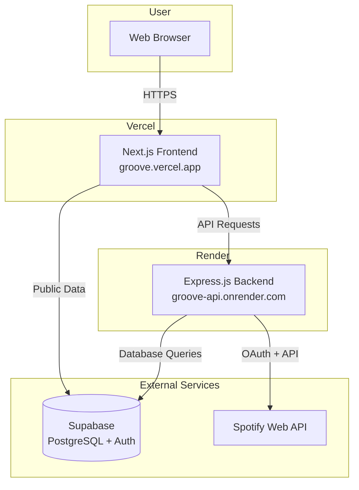
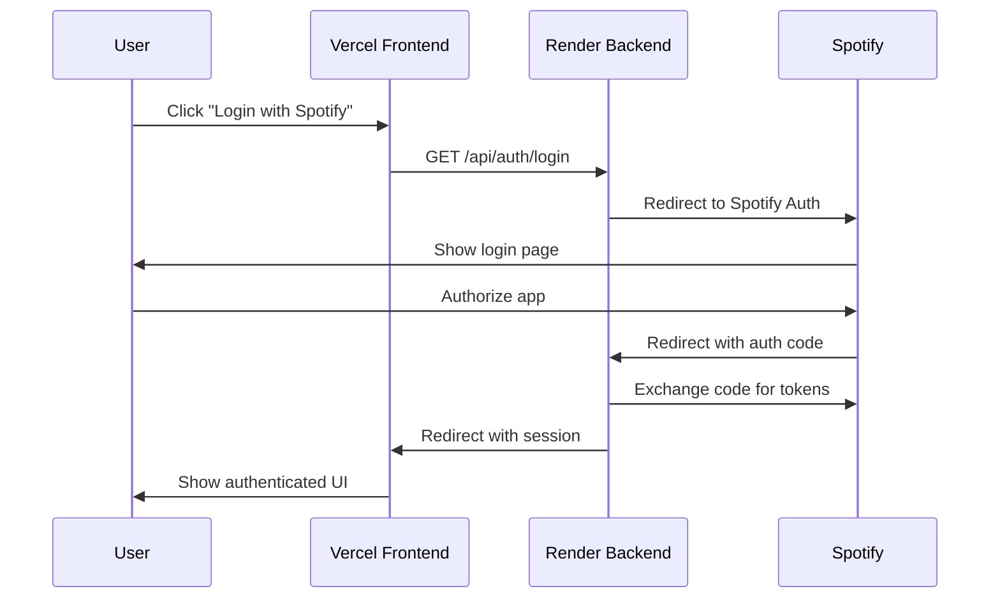

# Design Document

## Overview

This design document outlines the deployment architecture for the Groove application, with the Express.js backend deployed to Render and the Next.js frontend deployed to Vercel. The deployment strategy ensures secure communication between services, proper environment configuration, and seamless OAuth integration with Spotify.

## Architecture



## Components and Interfaces

### Backend Deployment (Render)

**Service Type:** Web Service

**Configuration:**
- Runtime: Node.js 20.x
- Build Command: `npm install`
- Start Command: `npm start`
- Health Check Path: `/health`
- Auto-Deploy: Enabled on main branch push

**Environment Variables:**
| Variable | Description | Example |
|----------|-------------|---------|
| PORT | Server port (auto-set by Render) | 10000 |
| NODE_ENV | Environment mode | production |
| SUPABASE_URL | Supabase project URL | https://xxx.supabase.co |
| SUPABASE_ANON_KEY | Supabase anonymous key | eyJhbGc... |
| SPOTIFY_CLIENT_ID | Spotify app client ID | abc123... |
| SPOTIFY_CLIENT_SECRET | Spotify app secret | xyz789... |
| SPOTIFY_REDIRECT_URI | OAuth callback URL | https://groove-api.onrender.com/api/auth/callback |
| FRONTEND_URL | Frontend URL for CORS | https://groove.vercel.app |

### Frontend Deployment (Vercel)

**Framework Preset:** Next.js

**Configuration:**
- Build Command: `npm run build` (auto-detected)
- Output Directory: `.next` (auto-detected)
- Install Command: `npm install`
- Node.js Version: 20.x

**Environment Variables:**
| Variable | Description | Example |
|----------|-------------|---------|
| NEXT_PUBLIC_SUPABASE_URL | Supabase project URL | https://xxx.supabase.co |
| NEXT_PUBLIC_SUPABASE_PUBLISHABLE_KEY | Supabase public key | sb_publishable_... |
| NEXT_PUBLIC_API_URL | Backend API URL | https://groove-api.onrender.com/api |

### CORS Configuration

The backend CORS configuration must be updated to accept requests from the Vercel frontend:

```javascript
app.use(cors({
  origin: process.env.FRONTEND_URL || 'http://localhost:3000',
  credentials: true
}));
```

In production, `FRONTEND_URL` will be set to the Vercel deployment URL.

### OAuth Flow



## Data Models

No new data models are required for deployment. Existing models remain unchanged:

- **Users**: Stored in Supabase, linked to Spotify accounts
- **Auth Tokens**: Encrypted Spotify tokens in Supabase
- **Vinyl Designs**: User-created vinyl artwork metadata

## Error Handling

### Deployment Failures

| Error Type | Detection | Resolution |
|------------|-----------|------------|
| Build failure | Render/Vercel build logs | Fix code issues, redeploy |
| Missing env vars | Application startup errors | Add missing variables in dashboard |
| CORS errors | Browser console errors | Verify FRONTEND_URL matches Vercel URL |
| OAuth redirect mismatch | Spotify error page | Update Spotify Dashboard redirect URI |
| Health check failure | Render dashboard alerts | Check server logs, verify PORT usage |

### Runtime Errors

- Backend errors are logged to Supabase error_logs table
- Frontend errors are captured by ErrorBoundary component
- Rate limit errors (429) are handled by middleware and displayed to users

## Testing Strategy

### Dual Testing Approach

**Unit Tests:**
- Verify environment variable loading
- Test CORS configuration with different origins
- Validate health check endpoint response

**Property-Based Tests:**
- Use fast-check library (already configured in project)
- Minimum 100 iterations per property test
- Tag tests with format: `**Feature: deployment-plan, Property {number}: {property_text}**`

### Deployment Verification Checklist

1. **Health Check**: `curl https://groove-api.onrender.com/health`
2. **CORS Verification**: Frontend API calls succeed without CORS errors
3. **OAuth Flow**: Complete Spotify login from production frontend
4. **API Integration**: Fetch playlists, control playback
5. **Image Loading**: Verify Spotify album artwork displays correctly

### Pre-Deployment Testing

Before deploying, run existing test suites:
```bash
# Backend tests
cd backend && npm test

# Frontend tests
cd frontend && npm run test:run
```


## Correctness Properties

*A property is a characteristic or behavior that should hold true across all valid executions of a system-essentially, a formal statement about what the system should do. Properties serve as the bridge between human-readable specifications and machine-verifiable correctness guarantees.*

Based on the acceptance criteria analysis, the following testable properties have been identified:

### Property 1: PORT Environment Variable Binding

*For any* valid PORT environment variable value, the Express server configuration SHALL use that port value for binding.

**Validates: Requirements 1.3**

### Property 2: CORS Origin Configuration

*For any* FRONTEND_URL environment variable value, the CORS middleware SHALL configure that URL as the allowed origin for cross-origin requests.

**Validates: Requirements 3.1, 3.3**

### Verification Examples

The following are specific examples that verify correct behavior:

**Example 1: Health Check Response**
- The `/health` endpoint SHALL return status code 200 with JSON body `{ status: 'ok', message: 'Groove backend is running' }`
- **Validates: Requirements 1.4**

**Example 2: CORS Credentials Configuration**
- The CORS configuration SHALL include `credentials: true`
- **Validates: Requirements 3.2**

**Example 3: Spotify Redirect URI Pattern**
- The SPOTIFY_REDIRECT_URI SHALL match the pattern `https://<domain>/api/auth/callback`
- **Validates: Requirements 4.3**

**Example 4: Next.js Image Remote Patterns**
- The next.config.mjs SHALL include remote patterns for `mosaic.scdn.co`, `i.scdn.co`, and `image-cdn-ak.spotifycdn.com`
- **Validates: Requirements 7.1**
