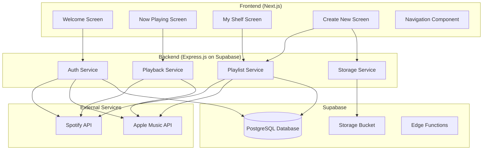

# Design Document: Groove - Vinyl Spotify Player

## Overview

Groove is a mobile-first web application that transforms music streaming into a nostalgic vinyl record experience. The application consists of a Next.js frontend with Tailwind CSS styling and an Express.js backend hosted on Supabase. Users authenticate with Spotify or Apple Music, view their playlists as vinyl records on virtual shelves, control playback through an interactive turntable interface, and create custom vinyl designs for new playlists.

### Key Features

- Animated welcome/splash screen with dual music service authentication
- "My Shelf" view with vinyl records arranged on wooden shelves
- "Now Playing" turntable interface with spinning vinyl animation
- "Create New" vinyl customization with color picker and image gallery
- Real-time playback information and track queue display

## Architecture



### Technology Stack

- **Frontend**: Next.js 14+ with App Router, React 18, Tailwind CSS, JavaScript
- **Backend**: Express.js (JavaScript) hosted on Supabase Edge Functions
- **Database**: Supabase PostgreSQL with Row Level Security
- **Storage**: Supabase Storage for custom vinyl images
- **Authentication**: OAuth 2.0 with Spotify and Apple Music
- **State Management**: React Context + useReducer for playback state

## Components and Interfaces

### Frontend Components

#### 1. Welcome/Splash Components

```javascript
// SplashScreen - Animated vinyl logo intro
// Props: { onAnimationComplete: Function, duration: number (default 2000ms) }

// WelcomeScreen - Authentication options
// Props: { onSpotifyConnect: Function, onAppleMusicConnect: Function }
```

#### 2. Now Playing Components

```javascript
// VinylTurntable - Main playback visualization
// Props: { playlist, currentTrack, isPlaying, progress (0-100), onSeek: Function }

// PlaybackControls - Play/Pause/Skip buttons
// Props: { isPlaying, onPlay, onPause, onSkipForward, onSkipBackward }

// TrackQueue - List of upcoming tracks
// Props: { tracks, currentIndex, onTrackSelect, onViewAll }
```

#### 3. My Shelf Components

```javascript
// VinylShelf - Row of vinyl records on wooden shelf
// Props: { playlists, onVinylSelect: Function }

// VinylRecord - Individual vinyl representation
// Props: { playlist, coverImage, color, onClick }
```

#### 4. Create New Components

```javascript
// VinylCreator - Main creation interface
// Props: { onCreatePlaylist: Function }

// ColorPicker - Vinyl color selection
// Props: { selectedColor, colors, onColorSelect }

// ImageGallery - Label image selection
// Props: { images, selectedImage, onImageSelect, onImageUpload }
```

#### 5. Navigation Components

```javascript
// Header - Screen title and menu
// Props: { title, onMenuToggle }

// NavigationMenu - Slide-out menu
// Props: { isOpen, currentScreen, onNavigate, onClose }

// Screen types: 'now-playing' | 'my-shelf' | 'create-new'
```

### Backend API Interfaces

#### Authentication Endpoints

```javascript
// POST /api/auth/spotify - Initiate Spotify OAuth
// POST /api/auth/apple - Initiate Apple Music OAuth
// POST /api/auth/callback - Handle OAuth callback
// POST /api/auth/refresh - Refresh access token
// POST /api/auth/logout - Clear session

// AuthResponse shape:
// { accessToken, refreshToken, expiresAt, provider: 'spotify'|'apple', user }
```

#### Playlist Endpoints

```javascript
// GET /api/playlists - Fetch user playlists
// POST /api/playlists - Create new playlist
// PUT /api/playlists/:id/cover - Update playlist cover

// PlaylistResponse shape:
// { id, name, description, coverImage, trackCount, totalDuration, tracks }
```

#### Playback Endpoints

```javascript
// POST /api/playback/play - Start playback
// POST /api/playback/pause - Pause playback
// POST /api/playback/seek - Seek to position
// POST /api/playback/skip - Skip forward/backward
// GET /api/playback/state - Get current playback state

// PlaybackState shape:
// { isPlaying, currentTrack, position, duration, playlistId, trackIndex }
```

## Data Models

### Database Schema (Supabase PostgreSQL)

```sql
-- Users table
CREATE TABLE users (
  id UUID PRIMARY KEY DEFAULT gen_random_uuid(),
  provider VARCHAR(20) NOT NULL, -- 'spotify' or 'apple'
  provider_id VARCHAR(255) NOT NULL,
  email VARCHAR(255),
  display_name VARCHAR(255),
  created_at TIMESTAMP DEFAULT NOW(),
  updated_at TIMESTAMP DEFAULT NOW(),
  UNIQUE(provider, provider_id)
);

-- Auth tokens table
CREATE TABLE auth_tokens (
  id UUID PRIMARY KEY DEFAULT gen_random_uuid(),
  user_id UUID REFERENCES users(id) ON DELETE CASCADE,
  access_token TEXT NOT NULL,
  refresh_token TEXT NOT NULL,
  expires_at TIMESTAMP NOT NULL,
  created_at TIMESTAMP DEFAULT NOW(),
  updated_at TIMESTAMP DEFAULT NOW()
);

-- Custom vinyl designs table
CREATE TABLE vinyl_designs (
  id UUID PRIMARY KEY DEFAULT gen_random_uuid(),
  user_id UUID REFERENCES users(id) ON DELETE CASCADE,
  playlist_id VARCHAR(255) NOT NULL,
  color VARCHAR(7), -- hex color
  custom_image_url TEXT,
  created_at TIMESTAMP DEFAULT NOW(),
  updated_at TIMESTAMP DEFAULT NOW(),
  UNIQUE(user_id, playlist_id)
);

-- Error logs table
CREATE TABLE error_logs (
  id UUID PRIMARY KEY DEFAULT gen_random_uuid(),
  user_id UUID REFERENCES users(id),
  error_type VARCHAR(100),
  error_message TEXT,
  stack_trace TEXT,
  request_path VARCHAR(255),
  created_at TIMESTAMP DEFAULT NOW()
);
```

### JavaScript Data Shapes

```javascript
// User
// { id, provider: 'spotify'|'apple', providerId, email, displayName }

// Playlist
// { id, name, description, coverImage, trackCount, totalDuration, vinylColor, customImageUrl }

// Track
// { id, name, artist, album, duration, albumArt }

// VinylConfig
// { name, description, color, labelImage }
```

## Correctness Properties

*A property is a characteristic or behavior that should hold true across all valid executions of a system-essentially, a formal statement about what the system should do. Properties serve as the bridge between human-readable specifications and machine-verifiable correctness guarantees.*

Based on the prework analysis, the following correctness properties have been identified:

### Property 1: Token Refresh Preserves Authentication

*For any* expired access token with a valid refresh token stored in Supabase, the Backend Service SHALL successfully obtain a new access token without requiring user re-authentication.
**Validates: Requirements 1.6**

### Property 2: Playlist Rendering Consistency

*For any* list of playlists returned from the music service API, each playlist SHALL be rendered as a VinylRecord component on the My Shelf screen.
**Validates: Requirements 2.2**

### Property 3: Default Cover Fallback

*For any* playlist that has no cover image (coverImage is null or undefined), the VinylRecord component SHALL display the default Groove logo design.
**Validates: Requirements 2.3**

### Property 4: Vinyl Label Display

*For any* playlist with a valid cover image, when displayed on the Now Playing screen, the vinyl record label SHALL show that cover image.
**Validates: Requirements 3.1**

### Property 5: Seek Position Mapping

*For any* drag/scrub position on the vinyl record (0-100%), the seek position SHALL map proportionally to the current track's duration (position% * duration = seekTime).
**Validates: Requirements 3.4**

### Property 6: Skip Forward Track Advancement

*For any* playlist with multiple tracks, tapping skip forward SHALL increment the current track index by 1, wrapping to 0 when at the last track.
**Validates: Requirements 3.5**

### Property 7: Skip Backward Behavior

*For any* playback state, tapping skip backward SHALL: (a) restart the current track if elapsed time > 3 seconds, or (b) go to the previous track if elapsed time <= 3 seconds.
**Validates: Requirements 3.6**

### Property 8: Track Queue Completeness

*For any* playing playlist, the track queue display SHALL contain all tracks from the current track index to the end of the playlist, each showing track name and artist.
**Validates: Requirements 3.7**

### Property 9: Color Picker Real-time Update

*For any* color selection from the color picker, the vinyl preview component SHALL immediately reflect that color in its rendered state.
**Validates: Requirements 4.3**

### Property 10: Image Selection Application

*For any* image selected from the gallery, the vinyl label preview SHALL display that image as the center label.
**Validates: Requirements 4.4**

### Property 11: Image Upload Validation

*For any* uploaded file, the validation function SHALL accept only files with MIME type image/jpeg or image/png AND file size <= 4MB, rejecting all others.
**Validates: Requirements 4.5**

### Property 12: Track Info Display

*For any* currently playing track, the Now Playing screen SHALL display the track's name and artist properties in the info section below the turntable.
**Validates: Requirements 5.1**

### Property 13: Error Logging Completeness

*For any* failed API request, the Backend Service SHALL create an error_logs entry containing the error type, message, and request path before returning the error response.
**Validates: Requirements 7.3**

## Error Handling

### Frontend Error Handling

```javascript
// Error boundary for component-level errors
class ErrorBoundary extends React.Component {
  state = { hasError: false, error: null };
  
  static getDerivedStateFromError(error) {
    return { hasError: true, error };
  }
  
  render() {
    if (this.state.hasError) {
      return <ErrorFallback error={this.state.error} onRetry={this.reset} />;
    }
    return this.props.children;
  }
}

// Network error detection hook
const useNetworkStatus = () => {
  const [isOnline, setIsOnline] = useState(navigator.onLine);
  
  useEffect(() => {
    const handleOnline = () => setIsOnline(true);
    const handleOffline = () => setIsOnline(false);
    
    window.addEventListener('online', handleOnline);
    window.addEventListener('offline', handleOffline);
    
    return () => {
      window.removeEventListener('online', handleOnline);
      window.removeEventListener('offline', handleOffline);
    };
  }, []);
  
  return isOnline;
};
```

### Backend Error Handling

```javascript
// Express error middleware
const errorHandler = async (err, req, res, next) => {
  // Log to Supabase
  await supabase.from('error_logs').insert({
    user_id: req.user?.id,
    error_type: err.name,
    error_message: err.message,
    stack_trace: err.stack,
    request_path: req.path
  });
  
  // Return appropriate response
  const statusCode = err.statusCode || 500;
  res.status(statusCode).json({
    error: {
      message: err.message,
      code: err.code,
      retryable: err.retryable || false
    }
  });
};

// Rate limit handling
const rateLimitHandler = async (req, res, next) => {
  if (isRateLimited(req)) {
    return res.status(429).json({
      error: {
        message: 'Rate limit exceeded. Request queued.',
        retryAfter: getRetryAfter(req),
        queued: true
      }
    });
  }
  next();
};
```

### Error Types

| Error Type | HTTP Status | User Message | Retryable |
|------------|-------------|--------------|-----------|
| AUTH_EXPIRED | 401 | Session expired. Please log in again. | No |
| AUTH_FAILED | 401 | Authentication failed. Please try again. | Yes |
| API_UNAVAILABLE | 503 | Music service temporarily unavailable. | Yes |
| NETWORK_ERROR | 0 | No internet connection detected. | Yes |
| RATE_LIMITED | 429 | Too many requests. Please wait. | Yes |
| INVALID_IMAGE | 400 | Invalid image format or size. | No |
| PLAYLIST_CREATE_FAILED | 500 | Failed to create playlist. | Yes |

## Testing Strategy

### Dual Testing Approach

This project uses both unit tests and property-based tests for comprehensive coverage:

- **Unit Tests**: Verify specific examples, edge cases, and integration points
- **Property-Based Tests**: Verify universal properties that should hold across all inputs

### Testing Framework

- **Unit Testing**: Jest + React Testing Library
- **Property-Based Testing**: fast-check (JavaScript PBT library)
- **E2E Testing**: Playwright (optional)

### Property-Based Testing Configuration

```javascript
import fc from 'fast-check';

// Configure minimum 100 iterations per property test
const PBT_CONFIG = {
  numRuns: 100,
  verbose: true,
  seed: Date.now()
};

// Example property test structure
describe('Property Tests', () => {
  it('Property 5: Seek Position Mapping', () => {
    fc.assert(
      fc.property(
        fc.integer({ min: 0, max: 100 }), // position percentage
        fc.integer({ min: 1000, max: 600000 }), // duration in ms
        (position, duration) => {
          const seekTime = calculateSeekTime(position, duration);
          return seekTime === Math.floor((position / 100) * duration);
        }
      ),
      PBT_CONFIG
    );
  });
});
```

### Test Categories

#### Unit Tests

- Component rendering tests
- User interaction tests
- API endpoint tests
- Authentication flow tests
- Error handling tests

#### Property-Based Tests

Each correctness property from the design document will have a corresponding property-based test:

1. **Property 1**: Token refresh with various expiration states
2. **Property 2**: Playlist array to VinylRecord component mapping
3. **Property 3**: Null/undefined cover image fallback
4. **Property 4**: Cover image to vinyl label mapping
5. **Property 5**: Seek position percentage to time calculation
6. **Property 6**: Track index increment with wraparound
7. **Property 7**: Skip backward conditional behavior
8. **Property 8**: Track queue array completeness
9. **Property 9**: Color picker state synchronization
10. **Property 10**: Image selection state application
11. **Property 11**: File validation (type and size)
12. **Property 12**: Track info display completeness
13. **Property 13**: Error log entry creation

### Test File Structure

```text
frontend/
├── __tests__/
│   ├── unit/
│   │   ├── components/
│   │   │   ├── VinylRecord.test.js
│   │   │   ├── VinylTurntable.test.js
│   │   │   ├── PlaybackControls.test.js
│   │   │   └── ...
│   │   └── hooks/
│   │       ├── usePlayback.test.js
│   │       └── useAuth.test.js
│   └── properties/
│       ├── playlist.properties.test.js
│       ├── playback.properties.test.js
│       ├── vinyl.properties.test.js
│       └── validation.properties.test.js
backend/
├── __tests__/
│   ├── unit/
│   │   ├── auth.test.js
│   │   ├── playlists.test.js
│   │   └── playback.test.js
│   └── properties/
│       ├── auth.properties.test.js
│       └── error-handling.properties.test.js
```

### Property Test Annotation Format

All property-based tests must include a comment referencing the correctness property:

```javascript
/**
 * **Feature: vinyl-spotify-player, Property 5: Seek Position Mapping**
 * For any drag/scrub position on the vinyl record (0-100%), 
 * the seek position SHALL map proportionally to the current track's duration.
 */
it('should map seek position proportionally to track duration', () => {
  // ... test implementation
});
```
