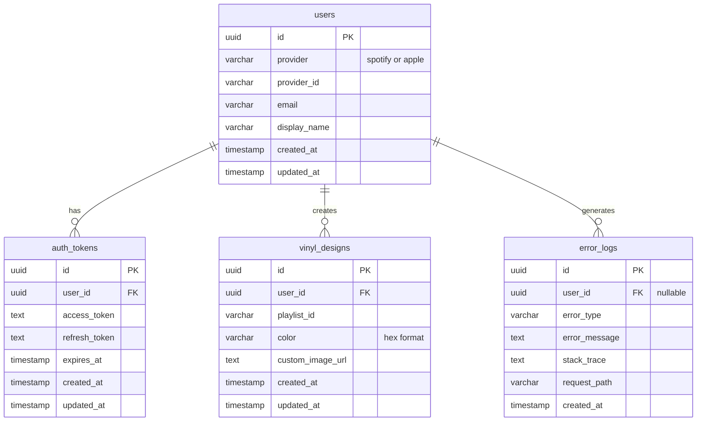

# Database Schema Diagram

## Entity Relationship Diagram



## Table Relationships

### users → auth_tokens (One-to-Many)
- Each user can have multiple auth tokens (though typically only one active)
- Cascade delete: When a user is deleted, all their tokens are deleted
- Used for OAuth token management and refresh

### users → vinyl_designs (One-to-Many)
- Each user can create multiple vinyl designs (one per playlist)
- Cascade delete: When a user is deleted, all their designs are deleted
- Unique constraint on (user_id, playlist_id) prevents duplicate designs

### users → error_logs (One-to-Many, Optional)
- Each user can have multiple error logs
- Set null on delete: When a user is deleted, error logs remain but user_id is nulled
- user_id is optional (some errors may occur before authentication)

## Indexes

### Performance Indexes
- `idx_users_provider_id` on users(provider, provider_id) - Fast OAuth lookups
- `idx_auth_tokens_user_id` on auth_tokens(user_id) - Fast token retrieval
- `idx_auth_tokens_expires_at` on auth_tokens(expires_at) - Token refresh queries
- `idx_vinyl_designs_user_id` on vinyl_designs(user_id) - User's vinyl collection
- `idx_vinyl_designs_playlist_id` on vinyl_designs(playlist_id) - Playlist lookups
- `idx_error_logs_user_id` on error_logs(user_id) - User error history
- `idx_error_logs_created_at` on error_logs(created_at DESC) - Recent errors
- `idx_error_logs_error_type` on error_logs(error_type) - Error categorization

## Storage

### vinyl-images Bucket
- **Type**: Public bucket (images are viewable by anyone)
- **Size Limit**: 4MB per file
- **Allowed Types**: image/jpeg, image/png
- **Access Control**: 
  - Upload: Authenticated users only
  - View: Public (anyone)
  - Update/Delete: Owner only

## Row Level Security (RLS)

All tables have RLS enabled with policies ensuring:

1. **Data Isolation**: Users can only access their own data
2. **Service Operations**: Backend service can perform admin operations
3. **Secure Defaults**: Deny by default, allow explicitly

### Policy Summary

| Table | SELECT | INSERT | UPDATE | DELETE |
|-------|--------|--------|--------|--------|
| users | Own profile | Service role | Own profile | - |
| auth_tokens | Own tokens | Service role | Service role | Service role |
| vinyl_designs | Own designs | Own designs | Own designs | Own designs |
| error_logs | Own logs | Service role | - | - |

## Triggers

### update_updated_at_column()
Automatically updates the `updated_at` timestamp on:
- users
- auth_tokens
- vinyl_designs

Triggered before UPDATE operations to maintain accurate modification timestamps.

## Data Flow Examples

### User Authentication Flow
```
1. User authenticates with Spotify/Apple Music
2. Backend receives OAuth tokens
3. INSERT into users (if new) or SELECT existing user
4. INSERT into auth_tokens with access_token, refresh_token, expires_at
5. Return user session to frontend
```

### Token Refresh Flow
```
1. Frontend detects token expiration
2. Backend SELECT auth_tokens WHERE user_id = ? AND expires_at < NOW()
3. Call Spotify/Apple Music refresh endpoint
4. UPDATE auth_tokens SET access_token = ?, expires_at = ?
5. Return new token to frontend
```

### Vinyl Creation Flow
```
1. User customizes vinyl (color, image)
2. If custom image: Upload to vinyl-images bucket
3. INSERT into vinyl_designs with user_id, playlist_id, color, custom_image_url
4. Return vinyl design to frontend
```

### Error Logging Flow
```
1. API request fails
2. Backend catches error
3. INSERT into error_logs with user_id, error_type, error_message, stack_trace
4. Return error response to frontend
```

## Constraints

### Unique Constraints
- `users(provider, provider_id)` - One account per provider
- `vinyl_designs(user_id, playlist_id)` - One design per playlist per user

### Check Constraints
- `users.provider` must be 'spotify' or 'apple'
- `vinyl_designs.color` should be 7 characters (hex format #RRGGBB)

### Foreign Key Constraints
- All foreign keys use CASCADE or SET NULL for referential integrity
- Prevents orphaned records in child tables

## Migration Order

The migrations must be run in this order due to dependencies:

1. **001_initial_schema.sql** - Creates tables and indexes
2. **002_rls_policies.sql** - Adds security policies (requires tables)
3. **003_storage_setup.sql** - Creates storage bucket (independent)

## Future Considerations

Potential schema enhancements for future versions:

- **Playlist cache table**: Store playlist metadata to reduce API calls
- **User preferences table**: Store UI preferences, theme settings
- **Sharing table**: Enable vinyl design sharing between users
- **Analytics table**: Track playback statistics and listening history
- **Collaboration table**: Allow collaborative playlists
